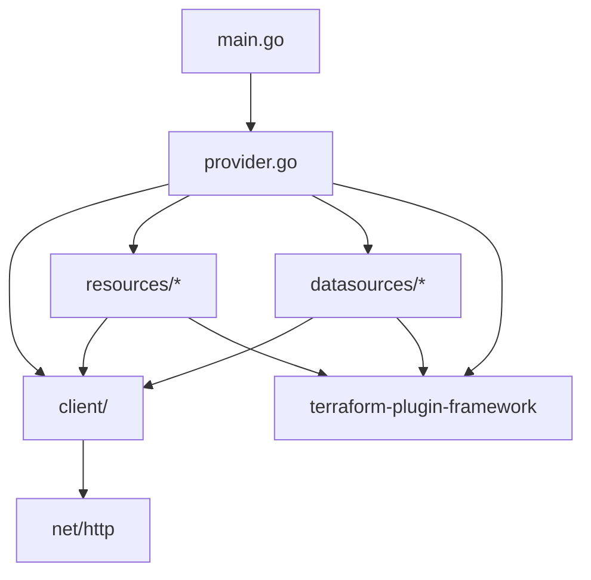

# Design Document: terraform-provider-ractermx

## Overview

This document describes the technical design for a Terraform provider that wraps the RacterMX REST API v2, enabling infrastructure-as-code management of email forwarding domains, aliases, DNS zone records, webhooks, blocklist entries, SMTP credentials, API keys, retention policies, organizations, domain tags, alert rules, notification preferences, and check catalog overrides.

The provider is built in Go using the modern HashiCorp Terraform Plugin Framework (`terraform-plugin-framework`), not the legacy SDKv2. It authenticates via Bearer token and targets a configurable base URL. The implementation follows a phased delivery approach across four releases.

### Key Design Decisions

1. **Plugin Framework over SDKv2**: The Plugin Framework provides compile-time type safety, first-class support for nested objects, and better diagnostics handling. All resources use the `resource.Resource` interface with typed models.

2. **Thin API client layer**: A dedicated `internal/client` package encapsulates all HTTP concerns (auth, retries, pagination, error parsing) so resource implementations stay focused on schema mapping.

3. **Composite IDs for ID-less resources**: Zone records and tag assignments lack server-assigned IDs. These use composite identifiers (e.g., `domain_id/name/type/content`) for state tracking and import.

4. **Write-once secret pattern**: SMTP credentials, API keys, and webhook secrets are only returned on creation. The provider stores these in state on create and marks them sensitive. Import operations note that secrets will be empty.

5. **Singleton resource pattern**: The retention policy is one-per-organization. It uses a fixed import ID (`"default"`) and omits Delete (removing from config leaves the server-side policy unchanged).

---

## Architecture

### Project Structure

```
terraform-provider-ractermx/
├── main.go                          # Entry point, registers provider server
├── go.mod / go.sum
├── GNUmakefile                      # build, install, test, testacc, generate
├── .goreleaser.yml                  # Cross-platform release builds
├── internal/
│   ├── provider/
│   │   └── provider.go              # Provider schema, Configure(), Resources(), DataSources()
│   ├── client/
│   │   ├── client.go                # HTTP client: auth, base URL, User-Agent
│   │   ├── errors.go                # API error parsing (422, 401, 404, 409, 429, 5xx)
│   │   ├── pagination.go            # Generic paginated list fetcher
│   │   └── retry.go                 # Exponential backoff for 429/5xx
│   ├── resources/
│   │   ├── domain.go                # ractermx_domain
│   │   ├── domain_verification.go   # ractermx_domain_verification
│   │   ├── alias.go                 # ractermx_alias
│   │   ├── zone_record.go           # ractermx_zone_record
│   │   ├── webhook.go               # ractermx_webhook
│   │   ├── blocklist_entry.go       # ractermx_blocklist_entry
│   │   ├── smtp_credential.go       # ractermx_smtp_credential
│   │   ├── api_key.go               # ractermx_api_key
│   │   ├── retention_policy.go      # ractermx_retention_policy
│   │   ├── organization.go          # ractermx_organization
│   │   ├── domain_tag.go            # ractermx_domain_tag
│   │   ├── domain_tag_assignment.go # ractermx_domain_tag_assignment
│   │   ├── alert_rule.go            # ractermx_alert_rule
│   │   ├── notification_preference.go # ractermx_domain_notification_preference
│   │   └── check_override.go        # ractermx_check_override
│   └── datasources/
│       ├── domain_dns_records.go    # ractermx_domain_dns_records
│       ├── domain_statistics.go     # ractermx_domain_statistics
│       ├── domain_health.go         # ractermx_domain_health
│       ├── security_score.go        # ractermx_security_score
│       ├── security_checks.go       # ractermx_security_checks
│       ├── check_catalog.go         # ractermx_check_catalog
│       └── quota.go                 # ractermx_quota
├── examples/                        # HCL examples for tfplugindocs
│   ├── provider/
│   ├── resources/
│   └── data-sources/
├── templates/                       # tfplugindocs templates
└── docs/                            # Generated documentation output
```

### Dependency Graph



The provider is the central coordinator. During `Configure()`, it creates a `client.Client` instance and stores it in provider data. Each resource and data source retrieves this client from the provider metadata during CRUD operations.

### Module Dependencies

| Module | Purpose |
|--------|---------|
| `github.com/hashicorp/terraform-plugin-framework` | Provider, resource, data source interfaces and schema types |
| `github.com/hashicorp/terraform-plugin-go` | Low-level protocol types |
| `github.com/hashicorp/terraform-plugin-testing` | Acceptance test framework |
| `github.com/hashicorp/terraform-plugin-log` | Structured logging |
| `pgregory.net/rapid` | Property-based testing |

---

## Components and Interfaces

### Provider Component

The provider implements `provider.Provider` and is responsible for:

1. **Schema**: Defines `api_key` (required, sensitive) and `base_url` (optional, default `https://ractermx.com`).
2. **Configure**: Validates configuration, resolves `api_key` from HCL or `RACTERMX_API_KEY` env var, constructs the API client.
3. **Resources**: Returns the list of all resource type constructors.
4. **DataSources**: Returns the list of all data source type constructors.

```go
// Provider model for configuration
type RactermxProviderModel struct {
    ApiKey  types.String `tfsdk:"api_key"`
    BaseUrl types.String `tfsdk:"base_url"`
}
```

### API Client Component

The client package provides a `Client` struct that all resources share:

```go
type Client struct {
    BaseURL    string            // e.g., "https://ractermx.com/api/v2"
    APIKey     string            // Bearer token
    HTTPClient *http.Client      // With configured timeout
    UserAgent  string            // "terraform-provider-ractermx/<version>"
}
```

#### Key Methods

| Method | Signature | Description |
|--------|-----------|-------------|
| `Get` | `(ctx, path) → (json, error)` | GET with auth headers |
| `Post` | `(ctx, path, body) → (json, error)` | POST with JSON body |
| `Patch` | `(ctx, path, body) → (json, error)` | PATCH with JSON body |
| `Put` | `(ctx, path, body) → (json, error)` | PUT with JSON body |
| `Delete` | `(ctx, path) → error` | DELETE request |
| `DeleteWithBody` | `(ctx, path, body) → error` | DELETE with JSON body (zone records) |
| `ListAll` | `(ctx, path) → ([]json, error)` | Paginated GET, fetches all pages |

#### Error Handling Strategy

| HTTP Status | Behavior |
|-------------|----------|
| 200-299 | Return parsed JSON |
| 401 | Return diagnostic: "Invalid or expired API credentials" |
| 404 (Read) | Return `nil` (resource removed from state) |
| 404 (other) | Return diagnostic: "Resource not found" |
| 409 | Return diagnostic with conflict details |
| 422 | Parse `errors` object, return field-level diagnostics |
| 429 | Retry with exponential backoff (3 attempts, 1s/2s/4s base) |
| 5xx | Retry with exponential backoff (2 attempts, 1s/2s base) |

#### Pagination

The API returns paginated results with a `meta` object:

```json
{
  "data": [...],
  "meta": {
    "total": 150,
    "per_page": 15,
    "current_page": 1,
    "last_page": 10
  }
}
```

The `ListAll` method iterates pages by appending `?page=N&per_page=100` until `current_page >= last_page`. For non-paginated list endpoints (webhooks, blocklist, tags), it returns the `data` array directly.

#### Retry Logic

```go
func (c *Client) doWithRetry(req *http.Request, maxRetries int) (*http.Response, error) {
    for attempt := 0; attempt <= maxRetries; attempt++ {
        resp, err := c.HTTPClient.Do(req)
        if err != nil {
            return nil, err
        }
        if resp.StatusCode == 429 || resp.StatusCode >= 500 {
            if attempt < maxRetries {
                backoff := time.Duration(1<<attempt) * time.Second
                time.Sleep(backoff)
                continue
            }
        }
        return resp, nil
    }
    return nil, fmt.Errorf("max retries exceeded")
}
```

### Resource Implementation Pattern

Each resource follows a consistent structure implementing the `resource.Resource` interface:

```go
type DomainResource struct {
    client *client.Client
}

// Terraform Plugin Framework interfaces
func (r *DomainResource) Metadata(...)    // Sets type name
func (r *DomainResource) Schema(...)      // Defines attributes
func (r *DomainResource) Configure(...)   // Gets client from provider
func (r *DomainResource) Create(...)      // POST to API, set state
func (r *DomainResource) Read(...)        // GET from API, refresh state
func (r *DomainResource) Update(...)      // PATCH to API, refresh state
func (r *DomainResource) Delete(...)      // DELETE from API
func (r *DomainResource) ImportState(...) // Parse import ID, set state
```

Each resource also defines a typed Go model struct that maps to the Terraform schema:

```go
type DomainResourceModel struct {
    ID                types.Int64  `tfsdk:"id"`
    Name              types.String `tfsdk:"name"`
    OrganizationID    types.Int64  `tfsdk:"organization_id"`
    IsForwarding      types.Bool   `tfsdk:"is_forwarding"`
    IsMonitored       types.Bool   `tfsdk:"is_monitored"`
    IsHosted          types.Bool   `tfsdk:"is_hosted"`
    DnsMode           types.String `tfsdk:"dns_mode"`
    CatchAllEnabled   types.Bool   `tfsdk:"catch_all_enabled"`
    CatchAllForwardTo types.String `tfsdk:"catch_all_forward_to"`
    MaxAliases        types.Int64  `tfsdk:"max_aliases"`
    // Computed
    IsActive          types.Bool   `tfsdk:"is_active"`
    IsVerified        types.Bool   `tfsdk:"is_verified"`
    VerificationToken types.String `tfsdk:"verification_token"`
    // ... timestamps
}
```

### Special Resource Patterns

#### 1. Zone Record: Composite ID / Old-New Update

Zone records have no server-assigned ID. The resource uses a composite key of `domain_id/name/type/content` as its Terraform ID.

- **Read**: Lists all zone records for the domain, then matches by name+type+content.
- **Update**: Sends `{ "old": { name, type, content, ttl }, "new": { name, type, content, ttl, priority, ... } }` to `PATCH /domains/{domainId}/zone-records`.
- **Delete**: Sends `{ name, type, content }` as a JSON body to `DELETE /domains/{domainId}/zone-records`.
- **Import**: Parses `{domain_id}/{name}/{type}/{content}` from the import ID string.

```go
type ZoneRecordResourceModel struct {
    DomainID types.Int64  `tfsdk:"domain_id"`
    Name     types.String `tfsdk:"name"`
    Type     types.String `tfsdk:"type"`
    Content  types.String `tfsdk:"content"`
    TTL      types.Int64  `tfsdk:"ttl"`
    Priority types.Int64  `tfsdk:"priority"`
    Weight   types.Int64  `tfsdk:"weight"`
    Port     types.Int64  `tfsdk:"port"`
}
```

The `RequiresReplace` plan modifier is applied to `domain_id` since moving a record between domains requires delete+create. Changes to `name`, `type`, or `content` are handled by the old/new update pattern (the API identifies the record by old values and applies new values).

#### 2. Write-Once Secrets (SMTP Credentials, API Keys, Webhooks)

These resources have sensitive attributes that the API only returns on creation:

- **Create**: Store the secret (password, api_key, secret) in Terraform state.
- **Read**: The API does not return the secret. The Read method preserves the existing state value for the secret field.
- **Import**: The secret field will be empty after import. Documentation warns users about this.

Schema definition uses `Sensitive: true` and `Computed: true`:

```go
schema.StringAttribute{
    Description: "SMTP password. Only available on creation.",
    Computed:    true,
    Sensitive:   true,
    PlanModifiers: []planmodifier.String{
        stringplanmodifier.UseStateForUnknown(),
    },
}
```

#### 3. Singleton Resource (Retention Policy)

The retention policy is one-per-organization with no Delete operation:

- **Create**: Calls `PUT /retention-policy` (upsert).
- **Read**: Calls `GET /retention-policy`.
- **Update**: Calls `PUT /retention-policy`.
- **Delete**: No-op. Logs a warning that the policy remains on the server.
- **Import**: Uses fixed ID `"default"`.

#### 4. Many-to-Many (Domain Tag Assignment)

Tag assignments link domains to tags:

- **Create**: Calls `POST /domains/{id}/tags` with `{ "tag_ids": [tagId] }`.
- **Read**: Calls `GET /domains/{id}` and checks if the tag is in the domain's `tags` array.
- **Delete**: Calls `DELETE /domains/{id}/tags/{tagId}`.
- **Import**: Parses `{domain_id}/{tag_id}` from the import ID.
- **ID**: Composite `{domain_id}/{tag_id}`.

#### 5. Nested Objects (Alert Rules)

Alert rules contain a `channels` list of notification channel objects:

```go
type AlertRuleChannelModel struct {
    ChannelType       types.String `tfsdk:"channel_type"`
    WebhookEndpointID types.Int64  `tfsdk:"webhook_endpoint_id"`
    EmailAddress      types.String `tfsdk:"email_address"`
}
```

The schema uses `schema.ListNestedAttribute` with the Plugin Framework's nested object support:

```go
"channels": schema.ListNestedAttribute{
    Required: true,
    NestedObject: schema.NestedAttributeObject{
        Attributes: map[string]schema.Attribute{
            "channel_type": schema.StringAttribute{Required: true},
            "webhook_endpoint_id": schema.Int64Attribute{Optional: true},
            "email_address": schema.StringAttribute{Optional: true},
        },
    },
    Validators: []validator.List{
        listvalidator.SizeBetween(1, 3),
    },
}
```

#### 6. Upsert Resources (Notification Preference, Check Override)

These resources use upsert semantics:

- **Create**: Calls the upsert endpoint (POST or PUT).
- **Delete**: Resets to defaults rather than deleting a server-side record.
  - Notification Preference: Sets `muted=false`, `min_priority=null`.
  - Check Override: Sends null values to reset to catalog defaults.

### Data Source Pattern

Data sources implement `datasource.DataSource` with only `Read`:

```go
type DomainHealthDataSource struct {
    client *client.Client
}

func (d *DomainHealthDataSource) Read(ctx context.Context, req datasource.ReadRequest, resp *datasource.ReadResponse) {
    var config DomainHealthModel
    resp.Diagnostics.Append(req.Config.Get(ctx, &config)...)
    
    result, err := d.client.Get(ctx, fmt.Sprintf("/domains/%d/health", config.DomainID.ValueInt64()))
    if err != nil {
        resp.Diagnostics.AddError("API Error", err.Error())
        return
    }
    
    // Map API response to model
    // ...
    resp.Diagnostics.Append(resp.State.Set(ctx, &config)...)
}
```

### Plan Modifiers and Validators

The provider uses Plugin Framework plan modifiers for:

| Modifier | Usage |
|----------|-------|
| `stringplanmodifier.RequiresReplace()` | Domain `name`, Alias `local_part`/`domain_id`, Blocklist `pattern` |
| `stringplanmodifier.UseStateForUnknown()` | Write-once secrets, computed timestamps |
| `int64planmodifier.RequiresReplace()` | SMTP `domain_id`, API Key all attributes |
| `int64planmodifier.UseStateForUnknown()` | Computed `id` fields |

Custom validators enforce:
- Domain name regex: `^[a-z0-9.-]+$`
- Alias local_part regex: `^[a-z0-9._+-]+$`
- Hex color format: `^#[0-9a-fA-F]{6}$`
- Alert rule cross-field validation (alert_type + condition + threshold_value)
- Event type enum validation for webhooks

---

## Data Models

### API Response Envelope

All API responses follow one of these patterns:

```go
// Single resource response
type APIResponse[T any] struct {
    Data    T      `json:"data"`
    Message string `json:"message,omitempty"`
}

// Paginated list response
type PaginatedResponse[T any] struct {
    Data []T  `json:"data"`
    Meta Meta `json:"meta"`
}

type Meta struct {
    Total       int `json:"total"`
    PerPage     int `json:"per_page"`
    CurrentPage int `json:"current_page"`
    LastPage    int `json:"last_page"`
}

// Error response (422)
type APIErrorResponse struct {
    Errors  map[string][]string `json:"errors,omitempty"`
    Message string              `json:"message,omitempty"`
    Error   string              `json:"error,omitempty"`
}
```

### Resource-to-API Mapping

| Terraform Resource | Create | Read | Update | Delete |
|---|---|---|---|---|
| `ractermx_domain` | `POST /domains` | `GET /domains/{id}` | `PATCH /domains/{id}` | `DELETE /domains/{id}` |
| `ractermx_domain_verification` | `POST /domains/{id}/verify-dns` | `GET /domains/{id}` | N/A (taint) | No-op |
| `ractermx_alias` | `POST /domains/{did}/aliases` | `GET /aliases/{id}` | `PATCH /aliases/{id}` | `DELETE /aliases/{id}` |
| `ractermx_zone_record` | `POST /domains/{did}/zone-records` | `GET /domains/{did}/zone-records` (match) | `PATCH /domains/{did}/zone-records` | `DELETE /domains/{did}/zone-records` |
| `ractermx_webhook` | `POST /webhooks` | `GET /webhooks` (match by ID) | `PUT /webhooks/{id}` | `DELETE /webhooks/{id}` |
| `ractermx_blocklist_entry` | `POST /blocklist` | `GET /blocklist` (match) | N/A (replace) | `DELETE /blocklist/{id}` |
| `ractermx_smtp_credential` | `POST /domains/{did}/smtp-credentials` | `GET /domains/{did}/smtp-credentials` (match) | N/A (replace) | `DELETE /smtp-credentials/{id}` |
| `ractermx_api_key` | `POST /api-keys` | `GET /api-keys` (match) | N/A (replace) | `DELETE /api-keys/{id}` |
| `ractermx_retention_policy` | `PUT /retention-policy` | `GET /retention-policy` | `PUT /retention-policy` | No-op |
| `ractermx_organization` | `POST /organizations` | `GET /organizations` (tree search) | `PATCH /organizations/{id}` | `DELETE /organizations/{id}` |
| `ractermx_domain_tag` | `POST /tags` | `GET /tags` (match) | `PATCH /tags/{id}` | `DELETE /tags/{id}` |
| `ractermx_domain_tag_assignment` | `POST /domains/{did}/tags` | `GET /domains/{did}` (check tags) | N/A | `DELETE /domains/{did}/tags/{tid}` |
| `ractermx_alert_rule` | `POST /alert-rules` | `GET /alert-rules/{id}` | `PATCH /alert-rules/{id}` | `DELETE /alert-rules/{id}` |
| `ractermx_domain_notification_preference` | `POST /domains/{id}/notification-preferences` | `GET /domains/{id}/notification-preferences` | `POST /domains/{id}/notification-preferences` | Reset to defaults |
| `ractermx_check_override` | `PUT /domains/{did}/check-overrides/{cid}` | `GET /check-catalog` (match) | `PUT /domains/{did}/check-overrides/{cid}` | Reset to defaults |

### Immutable Fields (Force Replacement)

| Resource | Immutable Fields | Reason |
|----------|-----------------|--------|
| `ractermx_domain` | `name` | Domain names cannot be renamed |
| `ractermx_alias` | `local_part`, `domain_id` | Alias identity is the local_part@domain pair |
| `ractermx_blocklist_entry` | `pattern` | No update endpoint |
| `ractermx_smtp_credential` | `domain_id`, `daily_limit`, `anonymous_reply_enabled`, `proxy_domain_id` | No general update endpoint |
| `ractermx_api_key` | All attributes | No update endpoint |
| `ractermx_domain_tag_assignment` | `domain_id`, `tag_id` | Assignment is the identity |
| `ractermx_check_override` | `domain_id`, `check_id` | Override is identified by domain+check |

---

## Correctness Properties

*A property is a characteristic or behavior that should hold true across all valid executions of a system — essentially, a formal statement about what the system should do. Properties serve as the bridge between human-readable specifications and machine-verifiable correctness guarantees.*

The following properties target the pure logic layers of the provider: configuration resolution, HTTP client behavior, ID parsing, error mapping, and validation. Resource CRUD lifecycle correctness is verified through acceptance tests against the real API (see Testing Strategy).

### Property 1: Provider configuration resolution

*For any* combination of (api_key present/absent in HCL) × (RACTERMX_API_KEY env var present/absent) × (base_url present/absent in HCL), the provider's Configure method should:
- Use the HCL api_key when present, otherwise fall back to the env var
- Return a diagnostic error when both api_key sources are absent
- Use the HCL base_url when present, otherwise default to `https://ractermx.com`
- Never produce a configured client when no api_key is available

**Validates: Requirements 1.2, 1.3, 1.4**

### Property 2: HTTP request construction

*For any* non-empty API key string, any valid base URL string, and any version string, every HTTP request constructed by the client should:
- Include an `Authorization` header with value `Bearer {api_key}`
- Target a URL that starts with `{base_url}/api/v2`
- Include a `User-Agent` header matching `terraform-provider-ractermx/{version}`

**Validates: Requirements 1.5, 1.6, 2.6**

### Property 3: API error response parsing

*For any* valid JSON object with an `errors` field containing a map of field names to string arrays, the client's error parser should produce one Terraform diagnostic per field, where each diagnostic's detail contains the field name and all associated error messages.

**Validates: Requirements 2.1**

### Property 4: Retry behavior for transient errors

*For any* HTTP status code in {429} ∪ [500, 599] and any sequence of N consecutive error responses followed by a 200 OK:
- When the status is 429, the client should retry up to 3 times (succeed when N ≤ 3, fail when N > 3)
- When the status is 5xx, the client should retry up to 2 times (succeed when N ≤ 2, fail when N > 2)
- Each retry should wait at least as long as the previous retry (exponential backoff)

**Validates: Requirements 2.2, 2.4**

### Property 5: Pagination completeness

*For any* total item count T and page size P (where P ≥ 1 and T ≥ 0), the client's ListAll method should return exactly T items by fetching ⌈T/P⌉ pages, and the returned items should be the concatenation of all pages in order.

**Validates: Requirements 2.7**

### Property 6: Composite ID round-trip

*For any* valid composite ID components:
- Zone record: (domain_id: positive int, name: non-empty string, type: non-empty string, content: non-empty string)
- Tag assignment: (domain_id: positive int, tag_id: positive int)
- Check override: (domain_id: positive int, check_id: non-empty string)

Formatting the components into the composite ID string and parsing the string back should yield the original components. Additionally, the formatted string should use `/` as the separator.

**Validates: Requirements 6.6, 14.3, 17.5**

### Property 7: Alert rule cross-field validation

*For any* combination of (alert_type, condition, threshold_value), the alert rule validator should:
- Accept `blacklist_change` only when condition is `any_change` and threshold_value is null
- Accept `deliverability_score` and `security_posture` only when condition is not `any_change` and threshold_value is a valid grade (A, B, C, D, F)
- Accept `dmarc_compliance` only when condition is not `any_change` and threshold_value is an integer string between 0 and 100
- Reject all other combinations with a descriptive error message

**Validates: Requirements 15.4, 15.5, 15.6**

---

## Error Handling

### API Error Categories

| Category | Detection | Provider Behavior |
|----------|-----------|-------------------|
| **Authentication failure** | 401 status | Return diagnostic: "Invalid or expired API credentials. Check your api_key configuration." |
| **Resource not found** | 404 status | During Read: remove from state (out-of-band deletion). During Create/Update/Delete: return diagnostic. |
| **Validation error** | 422 status + `errors` body | Parse each field's errors into individual Terraform attribute diagnostics. |
| **Conflict** | 409 status | Return diagnostic with the conflict message (e.g., "Alias 'info@example.com' already exists"). |
| **Rate limited** | 429 status | Retry with exponential backoff (1s, 2s, 4s). After 3 failures, return diagnostic. |
| **Server error** | 5xx status | Retry with exponential backoff (1s, 2s). After 2 failures, return diagnostic with status code. |
| **Network error** | Connection refused, timeout | Return diagnostic: "Unable to connect to RacterMX API at {base_url}." |
| **DNS hosting required** | 403 + specific message | Return diagnostic: "Zone records require DNS hosting. Set dns_mode to dns_hosted." |
| **Precondition failure** | 422 on org delete | Return the API's message (e.g., "Move or delete domains first.") as a diagnostic. |

### Diagnostic Severity

- **Error**: All API failures that prevent the operation from completing.
- **Warning**: Retention policy Delete (no-op, policy remains on server). Domain verification when some checks fail (resource still created with partial verification).

### Sensitive Data Protection

- `api_key` in provider config: `Sensitive: true` in schema.
- `password` on SMTP credentials: `Sensitive: true`, `UseStateForUnknown()`.
- `api_key` on API key resource: `Sensitive: true`, `UseStateForUnknown()`.
- `secret` on webhook resource: `Sensitive: true`, `UseStateForUnknown()`.
- The client never logs request/response bodies that may contain secrets.
- The `tflog` subsystem is used with `tflog.MaskFieldValuesWithFieldKeys` for sensitive fields.

---

## Testing Strategy

### Test Layers

The provider uses three complementary test layers:

#### 1. Unit Tests (Pure Logic)

Unit tests cover the internal logic that doesn't require API access:

- **Client package**: Error parsing, retry logic, pagination assembly, URL construction, header formatting.
- **Composite ID helpers**: Format/parse round-trips for zone records, tag assignments, check overrides.
- **Validation functions**: Alert rule cross-field validation, provider configuration resolution.
- **Model mapping**: API JSON response → Terraform model struct conversion.

Framework: Go standard `testing` package + `testify/assert` for assertions.

#### 2. Property-Based Tests

Property-based tests verify universal properties across generated inputs using `pgregory.net/rapid`:

| Property | Test File | Min Iterations |
|----------|-----------|----------------|
| Property 1: Provider config resolution | `internal/provider/provider_config_test.go` | 100 |
| Property 2: HTTP request construction | `internal/client/request_test.go` | 100 |
| Property 3: Error response parsing | `internal/client/errors_test.go` | 100 |
| Property 4: Retry behavior | `internal/client/retry_test.go` | 100 |
| Property 5: Pagination completeness | `internal/client/pagination_test.go` | 100 |
| Property 6: Composite ID round-trip | `internal/resources/composite_id_test.go` | 100 |
| Property 7: Alert rule validation | `internal/resources/alert_rule_validation_test.go` | 100 |

Each property test is tagged with a comment referencing the design property:
```go
// Feature: terraform-provider-ractermx, Property 6: Composite ID round-trip
func TestProperty_CompositeIDRoundTrip(t *testing.T) {
    rapid.Check(t, func(t *rapid.T) {
        // ...
    })
}
```

#### 3. Acceptance Tests (Integration)

Acceptance tests verify full CRUD lifecycles against the real RacterMX API:

- Framework: `github.com/hashicorp/terraform-plugin-testing` with `resource.Test` and `resource.TestStep`.
- Gate: Tests skip when `RACTERMX_API_KEY` is not set.
- Naming: Randomized names (`acctest-<random>.example.com`) to avoid collisions.
- Cleanup: Each test includes a `CheckDestroy` function verifying the resource was deleted.
- Parallelism: Tests use `resource.ParallelTest` where safe (no shared state).

Acceptance test structure per resource:

```go
func TestAccDomain_basic(t *testing.T) {
    rName := fmt.Sprintf("acctest-%s.example.com", acctest.RandString(8))
    resource.Test(t, resource.TestCase{
        PreCheck:                 func() { testAccPreCheck(t) },
        ProtoV6ProviderFactories: testAccProtoV6ProviderFactories,
        CheckDestroy:             testAccCheckDomainDestroy,
        Steps: []resource.TestStep{
            {
                Config: testAccDomainConfig(rName),
                Check: resource.ComposeAggregateTestCheckFunc(
                    resource.TestCheckResourceAttr("ractermx_domain.test", "name", rName),
                    resource.TestCheckResourceAttrSet("ractermx_domain.test", "id"),
                ),
            },
            // Import step
            {
                ResourceName:      "ractermx_domain.test",
                ImportState:       true,
                ImportStateVerify: true,
            },
            // Update step
            {
                Config: testAccDomainConfigUpdated(rName),
                Check: resource.ComposeAggregateTestCheckFunc(
                    resource.TestCheckResourceAttr("ractermx_domain.test", "max_aliases", "200"),
                ),
            },
        },
    })
}
```

### Test Coverage by Resource

| Resource | Unit | Property | Acceptance |
|----------|------|----------|------------|
| Provider config | ✓ | Property 1 | ✓ |
| API Client | ✓ | Properties 2-5 | — |
| `ractermx_domain` | ✓ | — | CRUD + Import |
| `ractermx_domain_verification` | — | — | Create + Read |
| `ractermx_alias` | ✓ (catchall logic) | — | CRUD + Import |
| `ractermx_zone_record` | ✓ | Property 6 | CRUD + Import |
| `ractermx_webhook` | — | — | CRUD + Import |
| `ractermx_blocklist_entry` | — | — | CRD + Import |
| `ractermx_smtp_credential` | — | — | CRD + Import |
| `ractermx_api_key` | — | — | CRD + Import |
| `ractermx_retention_policy` | ✓ (no-op delete) | — | RU + Import |
| `ractermx_organization` | — | — | CRUD + Import |
| `ractermx_domain_tag` | — | — | CRUD + Import |
| `ractermx_domain_tag_assignment` | ✓ | Property 6 | CD + Import |
| `ractermx_alert_rule` | ✓ | Property 7 | CRUD + Import |
| `ractermx_domain_notification_preference` | — | — | CRD + Import |
| `ractermx_check_override` | ✓ | Property 6 | CRD + Import |
| Data sources (all) | — | — | Read |

### Build and Release

#### GNUmakefile Targets

| Target | Command | Description |
|--------|---------|-------------|
| `build` | `go build -o terraform-provider-ractermx` | Compile the provider binary |
| `install` | `go build -o ~/.terraform.d/plugins/...` | Install locally for dev testing |
| `test` | `go test ./internal/... -v` | Run unit + property tests |
| `testacc` | `TF_ACC=1 go test ./internal/... -v -timeout 120m` | Run acceptance tests |
| `generate` | `go generate ./...` then `tfplugindocs generate` | Generate docs from schema |
| `lint` | `golangci-lint run` | Static analysis |
| `fmt` | `gofmt -s -w .` | Format code |

#### GoReleaser Configuration

The `.goreleaser.yml` produces signed binaries for the Terraform Registry:

- **Builds**: `linux/amd64`, `linux/arm64`, `darwin/amd64`, `darwin/arm64`, `windows/amd64`
- **Archives**: Zip format with `terraform-provider-ractermx_v{version}` naming
- **Signing**: GPG signing for registry verification
- **Changelog**: Auto-generated from conventional commits

#### tfplugindocs Integration

Documentation is generated from:
1. Schema annotations (attribute descriptions, types, defaults)
2. Example templates in `examples/` directory
3. Custom templates in `templates/` directory

The `go generate` directive in `main.go` triggers `tfplugindocs generate`.

### Phased Delivery Plan

| Phase | Resources | Data Sources | Milestone |
|-------|-----------|--------------|-----------|
| 1 | Provider, Domain, Alias, Domain Verification | DNS Records, Statistics, Health | Core email forwarding management |
| 2 | Zone Record, Webhook, Blocklist Entry | — | DNS and event management |
| 3 | SMTP Credential, API Key, Retention Policy, Organization | Quota | Sending and org management |
| 4 | Alert Rule, Domain Tag, Tag Assignment, Notification Preference, Check Override | Security Score, Security Checks, Check Catalog | Monitoring and security |

Each phase produces a tagged release with acceptance tests and generated documentation for all resources introduced in that phase.

